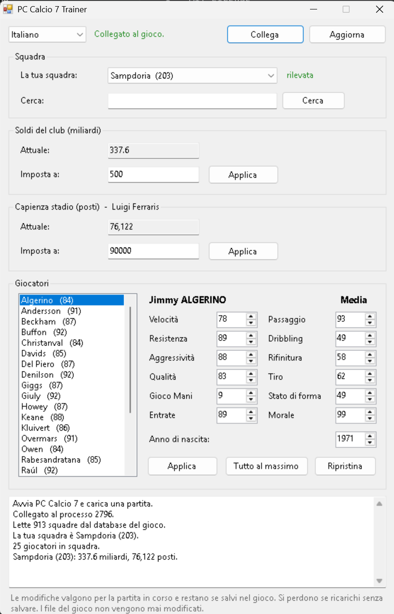

<div align="center">

### 🇮🇹 **Italiano** &nbsp;·&nbsp; 🇬🇧 [English](README.md) &nbsp;·&nbsp; 🇪🇸 [Español](README.es.md)

🌐 Sito ufficiale: **[calcio.dev](https://calcio.dev/)**

</div>

---

# PC Calcio 7 Trainer

Un trainer gratuito per **PC Calcio 7** e **PC Calcio 7 Plus** (Dinamic Multimedia, 1998).
Modifica la tua carriera mentre il gioco è aperto: soldi del club, capienza dello stadio,
e caratteristiche, età e morale di qualsiasi giocatore.

## In breve

### ⬇ [**Scarica PcCalcio7Trainer.exe**](https://github.com/andreaolivato/pccalcio7-trainer/releases/latest/download/PcCalcio7Trainer.exe)

Un solo file. Niente da installare. Il sito ufficiale del progetto è
**[calcio.dev](https://calcio.dev/)**.

1. Avvia **PC Calcio 7** e carica la tua partita
2. Apri il programma: si collega da solo e capisce qual è la tua squadra
3. Modifica soldi, stadio o giocatori e premi **Applica**
4. Esci dalla schermata del gioco e rientra, poi **salva dentro il gioco**

Windows segnalerà un "editore sconosciuto" e l'antivirus potrebbe protestare: il trainer scrive
nella memoria del gioco, cosa che fanno anche i malware. Il codice sorgente è tutto qui, se
preferisci compilarlo da solo.

> Progetto indipendente e non ufficiale, senza alcun legame con Dinamic Multimedia o con i
> titolari dei diritti. Non contiene file del gioco: serve avere già il gioco installato.



---

## Cosa puoi modificare

| | Dettaglio |
|---|---|
| **Soldi del club** | Fino a 900.000 miliardi |
| **Capienza stadio** | Da 100 a 1.000.000 di posti |
| **Caratteristiche** | Velocità, Resistenza, Aggressività, Qualità, Gioco Mani, Entrate, Passaggio, Dribbling, Rifinitura, Tiro, Stato di forma |
| **Media** | Non si modifica direttamente: il gioco la calcola come media di Velocità, Resistenza, Aggressività e Qualità, quindi alzando quelle sale anche la Media |
| **Età** | Impostando l'anno di nascita — dura finché il gioco non ricarica la carriera (nuova stagione o riavvio), perché le date di nascita vengono rilette dal database; basta riapplicarla |
| **Morale** | Da 23 a 99 |
| **Ripristina** | Riporta un giocatore ai valori che aveva prima delle tue modifiche |

Funziona sulla **tua** squadra e su **tutte le altre**: 925, cercabili per nome.

### Cosa non fa, volutamente

**Trasferimenti.** Spostare un giocatore da una squadra all'altra non è supportato. La rosa di
una squadra è costruita da una lista separata, e forzarci un giocatore senza le strutture che
il gioco crea durante un vero acquisto fa andare in crash il gioco. Se vuoi un giocatore,
mettiti i soldi e compralo dal **direttore sportivo** del gioco.

**Modifica dei salvataggi.** Tutto avviene nella memoria del gioco in esecuzione.

---

## Cosa serve

* Windows 8, 10 o 11 (oppure Windows 7 con .NET Framework 4 installato)
* PC Calcio 7 o PC Calcio 7 Plus, installato e avviato
* Nient'altro: nessun download aggiuntivo

---

## Come si usa

1. Avvia **PC Calcio 7** e carica la tua partita.
2. Apri **`PcCalcio7Trainer.exe`**. Si collega da solo e capisce qual è la tua squadra.
3. Modifica quello che vuoi e premi **Applica**.
4. **Esci dalla schermata del gioco e rientra**, altrimenti il numero sullo schermo resta
   quello vecchio: il gioco non ridisegna una schermata già aperta.
5. **Salva dentro il gioco** per rendere le modifiche permanenti.

Le modifiche vivono nella memoria del gioco. Restano quando salvi, si perdono se ricarichi
senza salvare. I file del gioco non vengono mai modificati.

### Se non riesce a collegarsi

La finestra ti dice qual è il problema e cosa fare:

* **Il gioco non è avviato** → avvialo, carica una partita, premi *Riprova*.
* **Il gioco è avviato ma non hai caricato una partita** → caricala, poi *Riprova*.
* **Ho trovato il gioco ma non riesco ad accedervi** → hai avviato il gioco come
  amministratore, quindi serve anche per il trainer: chiudilo, clic destro sull'icona,
  *Esegui come amministratore*.

---

## Cosa scaricare

Solo un file:

```
PcCalcio7Trainer.exe
```

Le traduzioni sono compilate dentro il programma: non ci sono file di configurazione o
lingue da copiare. `SelfTest.exe` serve solo per la diagnostica, non è necessario.

Il trainer **crea** tre piccoli file accanto a sé (`.club`, `.lang`, `.originals`) per
ricordare la squadra scelta, la lingua e i valori originali dei giocatori. Puoi cancellarli
senza problemi: perdi solo le preferenze.

---

## Avvertenze

**L'antivirus e Windows protesteranno.** Un programma che scrive nella memoria di un altro
programma somiglia a un malware per un antivirus, e un file non firmato scaricato da internet
fa comparire "editore sconosciuto". È normale e inevitabile senza un certificato di firma.
Se preferisci non fidarti del file, il codice è tutto qui e puoi compilarlo da solo.

**Può far crashare il gioco.** Modificare la memoria comporta questo rischio: è successo due
volte durante lo sviluppo. La versione attuale è molto più prudente, ma il rischio non è zero.
**Salva la partita prima di usarlo.** I file di salvataggio non vengono mai toccati, quindi al
massimo perdi i progressi non salvati.

**Valori assurdi danno risultati strani.** Uno stadio da 200.000 posti funziona, ma incassi e
spettatori vengono calcolati dalla capienza, quindi le schermate economiche possono diventare
poco credibili.

---

## Documentazione tecnica

Questa versione è una guida rapida. Il sito ufficiale del progetto è
**[calcio.dev](https://calcio.dev/)**. La documentazione completa è in inglese:

* **[README.md](README.md)** — versione completa, con come funziona e come compilarlo
* **[docs/MEMORY-MAP.md](docs/MEMORY-MAP.md)** — tutti i campi trovati in memoria, con il
  livello di certezza di ciascuno
* **[docs/METHODOLOGY.md](docs/METHODOLOGY.md)** — il metodo, per rifare questo lavoro su
  un'altra versione del gioco

## Contribuire

Traduzioni, segnalazioni e correzioni sono benvenute: vedi
[CONTRIBUTING.md](CONTRIBUTING.md). Aggiungere una lingua vuol dire un file nuovo in
`src/lang/`.

## Licenza

MIT — vedi [LICENSE](LICENSE).
